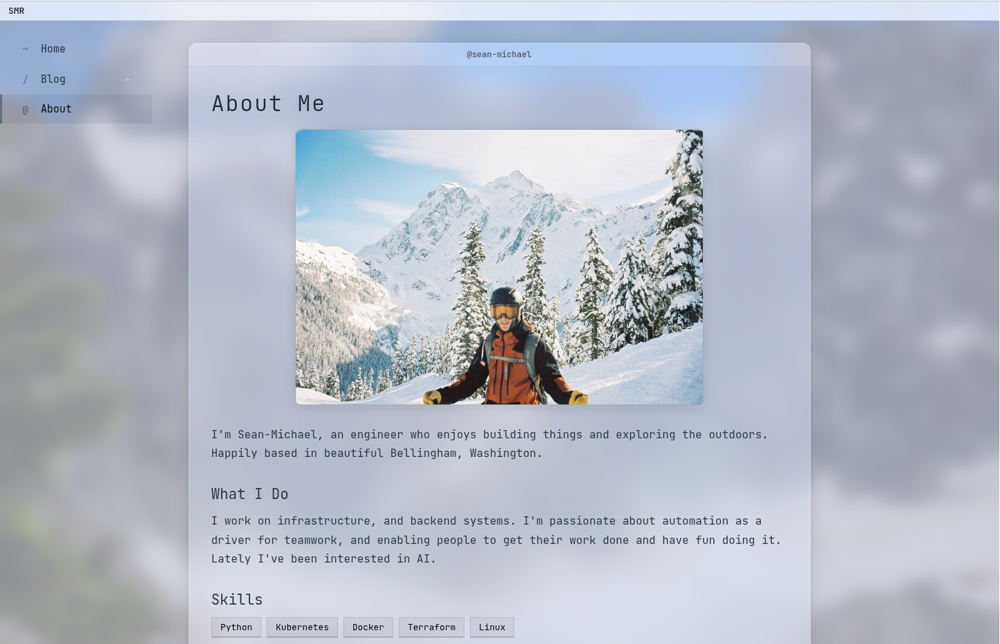

# Personal Website as Code

[](https://github.com/Sean-Michael/Sean-Michael.dev/actions/workflows/test-and-lint.yaml) [](https://github.com/Sean-Michael/Sean-Michael.dev/actions/workflows/build-and-push.yaml) [](https://github.com/Sean-Michael/Sean-Michael.dev/actions/workflows/deploy-latest.yaml)

This repository **is** my website. Infrastructure, application source, CI/CD pipelines, all defined as code. I make changes locally, push to main and boom. #GitOps

## File Tree

Here's the map of everything included.

```
.
├── app/                    # FastAPI application with HTMX
│   ├── main.py             # Routes and blog loading logic
│   ├── templates/          # Jinja2 templates
│   └── static/             # CSS, images, etc.
├── content/                # Markdown blog posts (gitignored, lives in S3)
├── scripts/                # Utility scripts
│   └── sync_content.py     # Sync local content to S3
├── infrastructure/         # Terraform for AWS
│   ├── main.tf             # EC2, security groups, IAM, S3
│   ├── scripts/setup.sh    # Instance bootstrapping
│   └── ...
├── .github/workflows/      # CI/CD pipelines
└── Dockerfile              # App Container image
```

## The Stack

Going for a 0% JS run with server-side rendering.

- **FastAPI** - Core API functionality handles routing
- **HTMX** - Enables dynamic content without JavaScript
- **Jinja2** - Templating engine
- **Markdown** - Blog posts with frontmatter metadata.
- **Docker** - Containerized for easy tests and deploys.
- **Nginx** - Reverse proxy sitting in front of uvicorn.

## Infrastructure

Everything runs on AWS and the Terraform that defines it lives in `infrastructure/`. What you see is what you get with this one.

- **EC2** (Ubuntu 24.04) - Single instance running Docker Compose
- **Elastic IP** - Pointing my Squarespace domain DNS to this IP
- **S3** - Content bucket for blog posts and assets
- **IAM** - Least privelaged roles for EC2 (SSM access) and GitHub Actions (deploy permissions)
- **Security Groups** - SSH from my laptop only, HTTP/HTTPS from anywhere

The EC2 instance bootstraps itself via user data script that installs Docker and pulls the latest image. No SSH required for deployments.

S3 also stores the terraform state but that's hidden in `.gitignore` so please don't try and dox me.

## CI/CD Pipeline

This was honestly the whole point of the exercise. I really wanted to flesh out the 'Website as Code' concept with some easy and fluid automation for updating the site incrementally.

Three workflows chain together automatically:

1. **Test and Lint** - Runs on push to main. Ruff for linting, pytest for tests. If this fails, nothing else runs. Style issues just raise an error.
2. **Build and Push** - Triggers after tests pass. Builds the Docker image and pushes to Docker Hub with SHA and updates `latest` tags.
3. **Deploy to EC2** - Triggers after build succeeds. Uses AWS SSM to run `docker compose pull && docker compose up -d` on the instance. No SSH keys or networking to manage with GitHub Action runners.

So with one push to main or merged PR, our website is updated in a matter of minutes!

## Content Workflow

Blog posts live in S3, not in git. Edit locally and sync when ready:

```bash
# Write/edit content locally
vim content/blog/new-post.md

# Preview locally
CONTENT_SOURCE=local uvicorn app.main:app --reload

# See what would sync
python scripts/sync_content.py --dry-run

# Publish to S3
python scripts/sync_content.py
```

No redeploy needed - sync and it's live.

## Development

I've been using [uv](https://docs.astral.sh/uv/) to manage the packages and virtual environment for this project.

```bash
# Create virtual environment and install dependencies
uv sync

# Or to include dev dependencies (pytest, ruff, httpx)
uv sync --dev

# Activate the virtual environment
source .venv/bin/activate

# Run locally with hot reload
uvicorn app.main:app --reload

# Run tests
pytest -v

# Lint
ruff check app/ tests/
ruff format app/ tests/
```

## Styling Notes

I was inspired in part by my perferred developer experience these days.

Though I used to be a major dark-mode enjoyer, recently I've actually gravitated to the light side.. 

MacOS Sequoia with the Silver Aerogel terminal theme and VSCode Nord Light certainly had an impact here. 

I basically wanted to emulated that setup, down to the `JetBrians Mono` font!



Trippy right? I wanted it to look like my desktop.

I like how the content window turned out with a simple header kind of emulating a terminal with the current working directory. :)

The background image is a photo I took of Mt.Shuksan in the North Cascades.

I'm still playing around with the sidebar, kind of going for a KDE inspired simple design where it's almost invisible.

And the best part? NO JAVASCRIPT :D