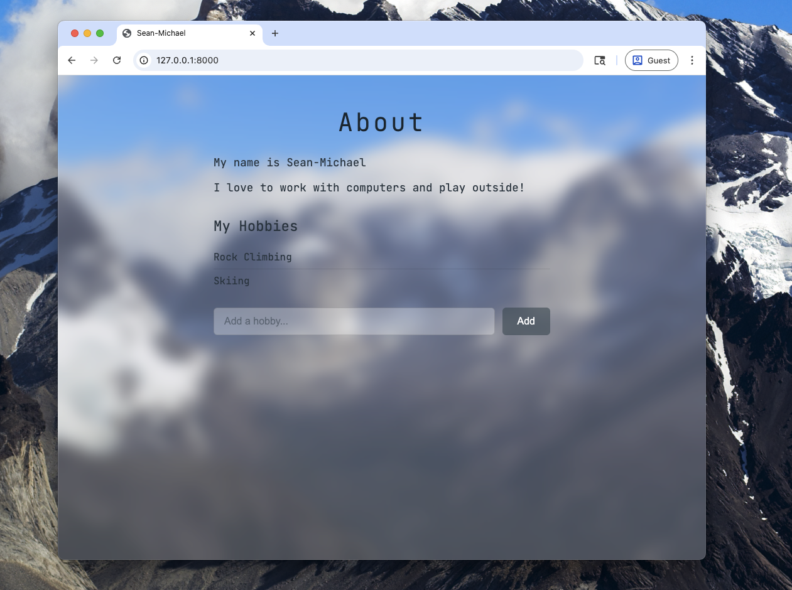

# Personal Website as Code

This repositor *is* my website. From the infrastructure code that deploys the hosting setup in AWS, to the frontend and backend python code for the web content. Including the CI/CD in GitHub Actions to build, test, and deploy!

It's going to be so much fun. :)

## Phase 1: Website

I'm trying to do a 0% JS run and 100% server-side rendering with templating for simplicity since I'm not a web developer.

I'll be using a simple FastAPI and HTMX stack to power my site with dynamic templating with Jinja2.

### Development notes

Running the application with reload:

```bash
uvicorn main:app --reload
```

For styling I'm trying to go for a look similar to my MacOS Sequioa mbp. I really dig the silver aerogel look with the opacity and blur on the transparent background of Patagonia. That's a place that just looks so beautifully rugged and alpine. The big ass glaciers, turqoise lakes and jagged peaks really stir the wonder in me.

Might be a bit cliche but I don't really care. Also the JetBrains mono font because I am #basic and it looks nice. :P



Trippy right? I wanted it to look just like my terminal. Could probably do with a couple bumps up on the opacity and a lightening of the background to improve readability of the dark fonts. I also might consider cropping the image but I'll likely replace it with one of my film photos.
